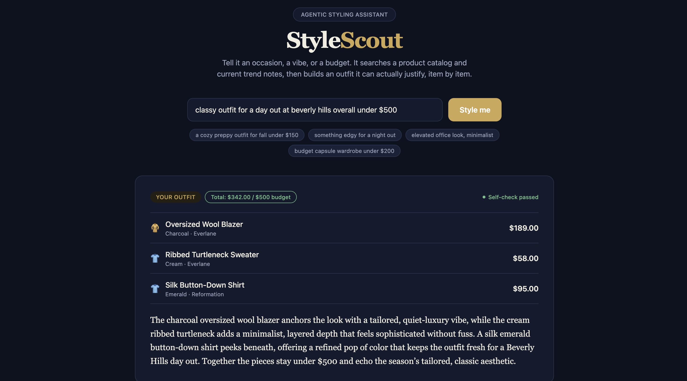

# StyleScout — Agentic Fashion Styling & Trend Assistant

A full-stack agentic RAG app: a FastAPI backend running a LangGraph agent
with a custom MCP tool server, and a React frontend with a custom UI
(product cards, trend chips, a self-check status indicator) instead of a
generic Streamlit form.

**Live demo:** [stylescout-tau.vercel.app](https://stylescout-tau.vercel.app)
**Backend:** [stylescout-wkas.onrender.com](https://stylescout-wkas.onrender.com) ([health check](https://stylescout-wkas.onrender.com/api/health))
**Source:** [github.com/cinnabonacai/stylescout](https://github.com/cinnabonacai/stylescout)

> Note: the backend is on Render's free tier, which spins down after 15
> minutes idle. The first request after a period of inactivity can take
> 30-60 seconds while it wakes back up — that's expected, not a bug.



## Context

Built as a second agentic-RAG portfolio project, reusing the architecture
pattern from an earlier clinical-research-assistant project (LangGraph +
MCP + hybrid RAG) but applied to a completely different domain — fashion
styling — and shipped as a real client/server app rather than a
single-script demo, to show the same skill set in a more standard
engineering shape.

## Problem

Generic LLM styling advice tends to invent products that don't exist, ignore
budget constraints, and give generic advice disconnected from actual
inventory or current trends. The goal was an agent that only recommends
items that are actually in a catalog, ties its reasoning to real trend
context, and checks its own output before returning it — served over a
real API so any frontend can consume it.

## Approach

- **Hybrid retrieval**: a single TF-IDF index over two sources — a
  structured product catalog (CSV) and unstructured trend notes (Markdown)
  — so one query retrieves both relevant products and the trend reasoning
  behind them.
- **Custom MCP tool server** (`backend/tools/mcp_server.py`): exposes
  `catalog_search`, `trend_lookup`, and `budget_check` as MCP tools, so the
  agent talks to the data layer over a standard protocol rather than
  importing functions directly — the data layer could be swapped for a
  real e-commerce API later with no change to the agent.
- **LangGraph agent** (`backend/agent/graph.py`) with four nodes:
  - `planner` — extracts a clean search query + budget from the raw request
  - `retriever` — calls the MCP tools for grounding context
  - `stylist` — synthesizes a recommendation, grounded only in retrieved
    items
  - `critic` — checks the recommendation actually references a retrieved
    item (catches hallucinated products) and loops back to the stylist
    once if it doesn't, then finalizes regardless so the agent always
    terminates
- **FastAPI backend** (`backend/main.py`): a thin REST layer over the
  agent — `POST /api/style` runs the full graph and returns a typed JSON
  response (Pydantic models), `GET /api/health` for liveness checks.
- **React + Vite + Tailwind frontend** (`frontend/`): a custom UI built
  around the response shape rather than a generic form — product cards
  with category icons, style tag chips, a relevance bar; a recommendation
  card with a pass/flag self-check indicator; a matched-trends panel; and
  a collapsible agent-trace panel showing the search query and critique.
  Dark theme by default with a light-mode fallback via
  `prefers-color-scheme`.

## Impact

Demonstrates the same agentic-RAG skill set (planner/retriever/synthesizer/
self-critic graph, custom MCP tool layer, hybrid structured+unstructured
retrieval) in a second domain, now wired end-to-end as a real client/server
application: a documented REST API, a decoupled frontend that could be
swapped or redeployed independently, and a concrete self-check loop that
reduces hallucinated product recommendations — directly observable in the
UI's self-check indicator.

## Challenge

Scoped and shipped in a single day, then extended to a proper full-stack
split the same day once the core agent was validated. The main engineering
tradeoff was retrieval: a full sentence-embedding model was skipped in
favor of TF-IDF to avoid a model-download dependency, which was the right
call for a same-day build and is called out in `backend/agent/retrieval.py`
as a clean swap point if higher retrieval quality is needed later. The
other deliberate scope cut was the LLM provider: built against Groq's free
tier by default (with Anthropic as an optional fallback) specifically so
the project has zero required API cost to run or demo.

---

## Running it

You'll need two terminals — one for the backend, one for the frontend.

### Backend (FastAPI)

```
cd backend
python3 -m venv venv
source venv/bin/activate          # Windows: venv\Scripts\activate
pip install -r requirements.txt
```

Get a free API key at [console.groq.com](https://console.groq.com) (no
credit card required) and set it:

```
export GROQ_API_KEY=your_key_here
```

(Alternatively, set `ANTHROPIC_API_KEY` if you'd rather use Claude. If
neither is set, the API runs in a clearly-labeled mock mode so the pipeline
is still inspectable without any key.)

Run the backend:

```
uvicorn main:app --reload --port 8000
```

Check it's up: `curl http://localhost:8000/api/health` should return
`{"status":"ok"}`.

### Frontend (React + Vite)

In a second terminal:

```
cd frontend
npm install
npm run dev
```

Open the URL it prints (usually `http://localhost:5173`). The frontend
reads the backend URL from `VITE_API_URL` in `frontend/.env` (defaults to
`http://localhost:8000`, already set for local dev).

Try a query like *"a cozy preppy outfit for fall under $150"* or
*"something edgy for a night out"*.

### Optional: legacy Streamlit UI

A single-file Streamlit version is kept in `legacy_streamlit/` as an
alternative lightweight UI (useful if you just want to poke at the agent
without running two servers). It needs its own `streamlit` install:

```
pip install streamlit
streamlit run legacy_streamlit/streamlit_app.py
```

(Run from the `backend/` directory, or adjust its `sys.path` line, since
it imports the `agent`/`tools` packages the same way `main.py` does.)

## Deploying

The live demo above is deployed exactly like this:

**Backend** — [Render](https://render.com), free tier:
1. Push this repo to GitHub.
2. New Web Service, pointing at the `backend/` directory.
3. Build command: `pip install -r requirements.txt`. Start command:
   `uvicorn main:app --host 0.0.0.0 --port $PORT`.
4. Add `GROQ_API_KEY` as an environment variable.

**Frontend** — [Vercel](https://vercel.com), free tier, pointing at the
`frontend/` directory:
1. Build command: `npm run build`. Output directory: `dist` (Vercel's Vite
   preset fills both in automatically).
2. Set `VITE_API_URL` to the deployed backend's URL.

CORS on the backend (`backend/main.py`) already allows all origins, so no
further config is needed to connect the two once both are deployed.

## Project structure

```
stylescout/
├── backend/
│   ├── data/
│   │   ├── catalog.csv          # structured product data
│   │   └── trend_notes.md        # unstructured trend/style notes
│   ├── agent/
│   │   ├── retrieval.py           # hybrid TF-IDF index over both sources
│   │   ├── llm.py                  # Groq / Anthropic / mock LLM wrapper
│   │   └── graph.py                  # LangGraph planner/retriever/stylist/critic
│   ├── tools/
│   │   └── mcp_server.py              # custom MCP tool server
│   ├── main.py                          # FastAPI app (REST layer over the agent)
│   └── requirements.txt
├── frontend/
│   ├── src/
│   │   ├── components/                  # Header, QueryForm, RecommendationCard,
│   │   │                                 # ProductCard, TrendPanel, AgentTracePanel
│   │   ├── lib/                          # api.js (backend client), categoryIcons.js
│   │   ├── App.jsx
│   │   └── index.css                     # design tokens, light/dark theme
│   └── package.json
├── legacy_streamlit/
│   └── streamlit_app.py                   # optional single-file alternative UI
└── README.md
```